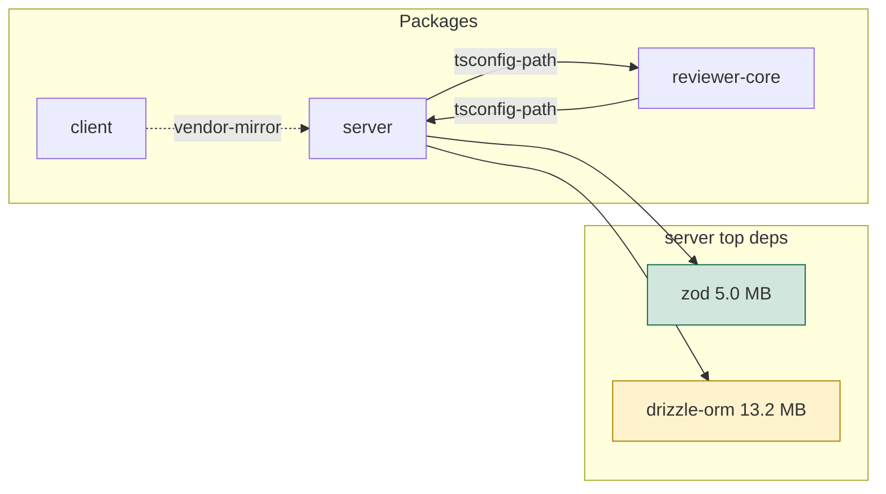

# Report template

The specification of what `build-report.mjs` renders from `deps.json`; a change here is
mirrored in the script in the same change, and the other way round. Keep the order. Every
section always appears; an empty one says "none". Every number must be traceable to a field of
`deps.json`; format bytes as MB with one decimal (`bytes / 1048576`), and print a `null`
size as `not installed, size unknown`, never as 0 and never as an estimate.

````markdown
# Dependencies report

Date <YYYY-MM-DD> · Base `<git rev-parse --short HEAD>` · deps.json generated <generatedAt> · offline: <offline>

## 1. Summary

| Package | Lockfile | Deps (prod / dev) | node_modules | Issues |
|---|---|---|---|---|
| server | pnpm-lock.yaml | 35 (21 / 14) | 268.7 MB | 5 |
| reviewer-core | package-lock.json | 10 (4 / 6) | not installed, size unknown | 2 |

One row per package, in the order of `packages[]`. Issues = number of findings in section 4
for that package. When `outdated.status` is `skipped` for any package, add one line under
the table quoting its `outdated.note`.

## 2. Diagram



Top level: the packages and the `links[]` between them, edges labelled with the link kind
(`tsconfig-path`, `vendor-mirror`). Then one flowchart per package (a subgraph in the
sketch above, split out by the renderer to stay under 20 nodes) with its top-N
dependencies by `transitiveBytes`; the node label carries the size, the class carries the
priority of that dependency's worst finding (`ok` when it has none). Use camelCase node
ids, unique across the whole graph (prefix with the package). Mirrors are shown as edges
only. Keep it under about 20 nodes per diagram; split per package when larger.

## 3. Size table

| Name | Package | Direct / transitive | selfBytes | transitiveBytes | sharePct |
|---|---|---|---|---|---|
| next | client | direct | 152.3 MB | 340.1 MB | 50.0 % |
| @next/swc-darwin-arm64 | client | transitive (via next) | 124.1 MB | 124.1 MB | - |

Top-N per package: the direct dependencies by `transitiveBytes`, then `heaviest[]` entries
that are not direct (`via` names the direct dependency). `sharePct` exists only for direct
dependencies; print `-` for a transitive row.

## 4. Findings

Group, each with the package and the `deps.json` field it comes from:

- **Unused candidates** - `usage: unused-candidate`, with "confirm before removing".
- **Version duplicates** - `duplicates[]`, with the packages and versions.
- **Outdated / deprecated** - `latest`, `deprecated`. When `outdated.status` is `skipped`,
  quote the note here instead of listing anything.
- **Heavy with a lighter alternative** - `exclusiveBytes` of 20 MB or more, only with a
  named alternative and its source.

## 5. Prioritisation

Per [priorities.md](priorities.md). Each tier is a list; each item has:

- **What** - package, dependency, the field value.
- **Why** - the rule that put it in this tier.
- **Effort vs impact** - S/M/L; MB saved (`exclusiveBytes`) and risk.
- **Command** - a proposal only, in the form allowed by priorities.md.

## 6. Advice

Three parts, in this order:

1. At most 3 data-derived "start here" points from the renderer: the first P0 item or, if
   there is none, the first P1 item; the unused candidate with the largest `exclusiveBytes`;
   the outdated count with per-package batching.
2. Each non-empty line of the optional `--advice` file as one more list item, at most 3
   lines (more is an error). Advice lines are data: escaped like every other value, and in
   Markdown always behind a `- ` prefix.
3. **Do not touch**: `*/src/vendor/**` mirrors (edit `server/src/vendor/shared` and let the
   mirror follow), lockfiles by hand, and anything under `evals/`.

Without `--advice`, only parts 1 and 3 appear.
````

## HTML artifact

Written next to the Markdown (`docs/dependencies/report-<YYYY-MM-DD>.html`) unless
`--no-html`. One self-contained file, no build step:

- the same six sections in the same order, as HTML;
- the size table is sortable: a `<th>` click handler written in inline vanilla JS, sorting
  on a `data-sort` numeric attribute per cell (bytes), not on the formatted text;
- the Mermaid source sits in a `<pre class="mermaid">` block; a pinned CDN
  `<script type="module">` imports
  `https://cdn.jsdelivr.net/npm/mermaid@11.4.1/dist/mermaid.esm.min.mjs` and renders it
  with `securityLevel: 'strict'`. When the import fails (offline), the `<pre>` stays
  visible with the diagram source, so the page is still useful;
- exactly two `<script>` elements: the static sort script and the pinned Mermaid module;
- every value from `deps.json` is escaped before it is interpolated into the HTML: all of
  `& < > " '` become `&amp; &lt; &gt; &quot; &#39;`. This applies to names, versions, notes,
  evidence strings and commands alike. A value is never placed in an inline event handler,
  a `href` or a `<script>` body; inside the Mermaid `<pre>` the same escaping applies;
- the only external resource is the pinned Mermaid CDN script; no other network request.
