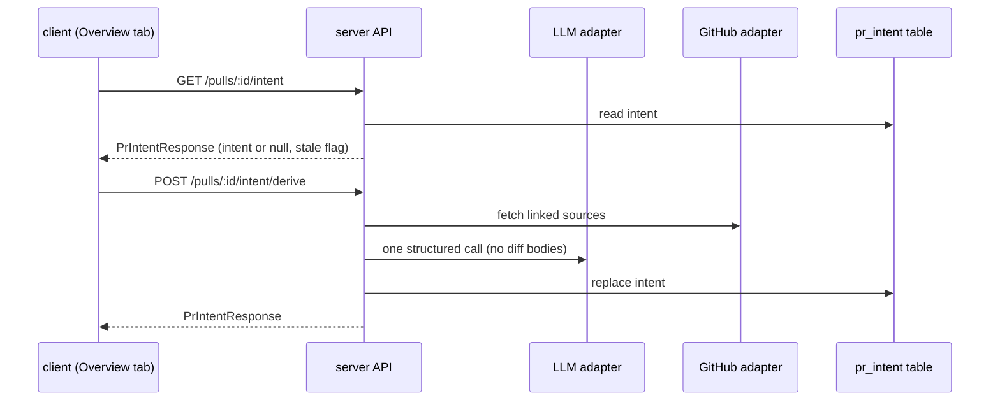

# Spec: PR intent card
Spec ID: SPEC-00-intent-card
Status: draft
Supersedes: none

<!-- Reference example for the spec-writing skill. It shows the format and the level of
detail. It is not a real spec of the repo: SPEC-00 is never used by a real spec. -->

## Problem and user

A reviewer opens a pull request and does not know what the author wanted to change.
The PR body is often short or empty. Findings outside that goal add noise.

The user is a developer who reviews PRs in DevDigest. They need to see the intent of
the PR before they read findings, and they need to know how much they can trust it.

## Goals / Non-goals

Goals:
- Show the derived intent of a PR on the Overview tab, before the Description.
- Show what is in scope and out of scope, and how sure the system is.
- Let the user derive the intent again when the PR changed.

Non-goals:
- A "Risk areas" section. No producer of that data exists.
- The intent card on the Findings tab.
- Locales other than `en`.

## User stories

- **US-1** As a reviewer, I want to see the PR intent first on the Overview tab, so that I
  understand the goal before I read findings. → AC-1, AC-2
- **US-2** As a reviewer, I want to know when the intent is old or unsure, so that I do not
  trust it too much. → AC-3, AC-4, AC-5
- **US-3** As a reviewer, I want to derive the intent again, so that it matches the latest
  commit. → AC-6, AC-7

## Acceptance criteria (EARS)

- **AC-1** [client] WHEN the user opens the Overview tab of a PR, the Overview tab shall show
  the intent card above the Description. *Verify: e2e*
- **AC-2** [client] WHILE an intent exists for the PR, the intent card shall show the summary,
  the IN SCOPE list, the OUT OF SCOPE list, the confidence and the list of sources.
  *Verify: unit*
- **AC-3** [server] The API shall mark an intent as stale when its head SHA differs from the
  current head SHA of the PR. *Verify: it*
- **AC-4** [client] WHILE the intent is stale, the intent card shall show the badge "Stale —
  PR updated since derivation" and show "Re-derive intent" as the primary action.
  *Verify: unit*
- **AC-5** [client] WHILE the confidence of the intent is `low`, the intent card shall show
  the chip "Low confidence". *Verify: unit*
- **AC-6** [server] WHEN the API receives a derive request for a PR, the API shall derive the
  intent at the current head SHA and replace the stored intent. *Verify: it*
- **AC-7** [client] WHILE a derive request is running, the intent card shall disable the
  derive action, show the label "Deriving…" and keep the current content. *Verify: unit*
- **AC-8** [client] IF no intent exists for the PR, THEN the intent card shall show the text
  "No intent derived yet" and a "Derive intent" action. *Verify: unit*
- **AC-9** [client] IF the derive request fails, THEN the intent card shall show a toast with
  the API error message and keep its previous state. *Verify: unit*
- **AC-10** [server] IF a source linked from the PR cannot be fetched, THEN the API shall keep
  the source in the list with status `missing` and a reason, and shall not invent its
  content. *Verify: it*
- **AC-11** [client] IF the summary or a scope item contains HTML or Markdown, THEN the intent
  card shall render it as plain text. *Verify: unit*

## Module interactions

Contracts at the boundary (existing, `server/src/vendor/shared`):

| Contract | Direction | Fields used |
|----------|-----------|-------------|
| `GET /pulls/:id/intent` → `PrIntentResponse` | server → client | `intent` (`PrIntentRecord` or `null`) |
| `POST /pulls/:id/intent/derive` → `PrIntentResponse` | client → server → client | same |
| `PrIntentRecord` | server → client | `summary`, `in_scope`, `out_of_scope`, `confidence`, `sources[]` (`kind`, `ref`, `status`, `reason`), `stale`, `model`, `derived_at` |

Errors: `404` when the PR does not exist; `502` when the model call fails. Table read and
written: `pr_intent` (existing).

## Edge cases

- **EC-1** The PR was never analysed, so no intent exists. → AC-8
- **EC-2** The model call fails or times out during derive. → AC-9
- **EC-3** The PR body links an issue that returns 404. → AC-10
- **EC-4** The PR summary contains HTML or a Markdown link. → AC-11

## Non-functional requirements

- **NFR-1** Performance: the API shall answer `GET /pulls/:id/intent` within 300 ms at p95 on
  the seeded dataset, because it reads one row and calls no model. *Verify: it*
- **NFR-2** Cost: one derive shall make at most 1 model call plus 1 repair retry.
  *Verify: unit*
- **NFR-3** Accessibility: every action on the card shall be reachable with the keyboard,
  with 0 axe violations of level A or AA. *Verify: e2e*

## Assumptions

- **A-1** The intent route already returns `stale`. Risk if wrong: the server needs a
  contract change first.
- **A-2** Reviewers read the Overview tab before the Findings tab. Risk if wrong: the card
  is seen too late and US-1 is not met.

## Inputs and provenance

- Design: `designs/intent-card/overview.png` (example path; read).
- Code read: `client/src/app/repos/[repoId]/pulls/[number]/`, `server/src/modules/`,
  `server/src/vendor/shared/contracts/review-api.ts`.
- Existing spec: `server/.spec/intent-layer.spec.md`.
- Round 1, Q: "Show a Risk areas section?" → No (Non-goal).
- Round 1, Q: "What does the card show while derive runs?" → Keep content, disable action
  (AC-7).

## Untrusted inputs

- PR title, PR body and linked issues come from outside. The server wraps them as
  untrusted text in the model prompt (`wrapUntrusted`).
- The summary and the scope lists are model output. The client renders them as plain
  text (AC-11).
- The API response is checked against `PrIntentResponse` before use.

## Open questions

- **Q-1** (non-blocking) Should the card collapse when the PR has more than 20 sources?
- **Q-2** (planner) Reuse the existing `Skeleton` for loading, or a card-specific one?

## Traceability

| AC | Stories | Edge cases | NFR | Verify |
|----|---------|------------|-----|--------|
| AC-1 | US-1 | — | NFR-3 | e2e |
| AC-2 | US-1 | — | — | unit |
| AC-3 | US-2 | — | NFR-1 | it |
| AC-4 | US-2 | — | — | unit |
| AC-5 | US-2 | — | — | unit |
| AC-6 | US-3 | — | NFR-2 | it |
| AC-7 | US-3 | — | — | unit |
| AC-8 | — | EC-1 | — | unit |
| AC-9 | — | EC-2 | — | unit |
| AC-10 | — | EC-3 | — | it |
| AC-11 | — | EC-4 | — | unit |
