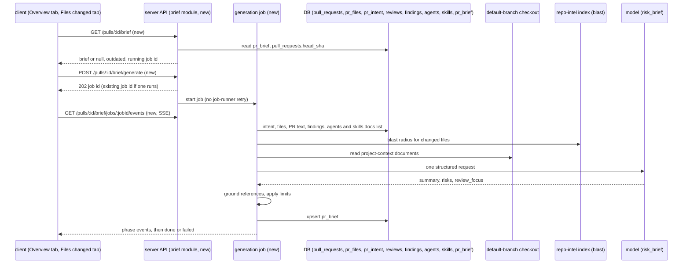
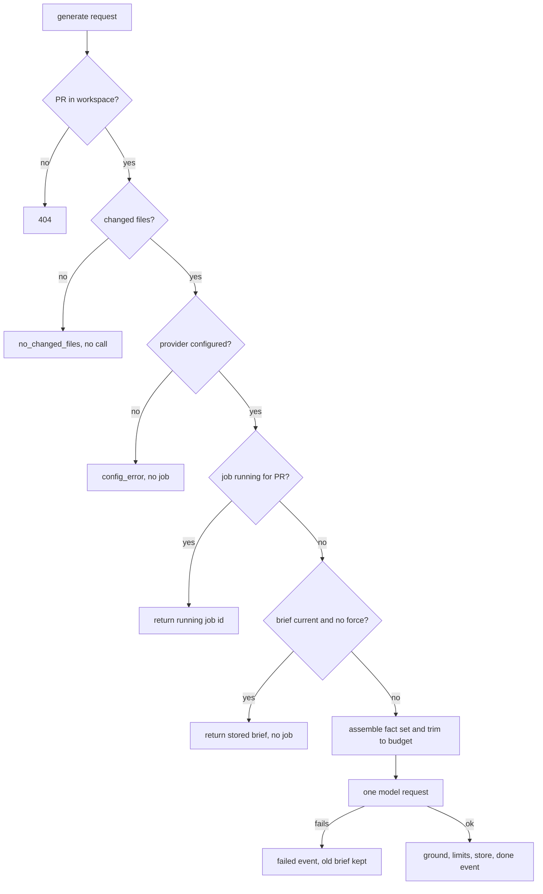

# Spec: PR Brief
Spec ID: SPEC-02-pr-brief
Status: approved
Supersedes: none

## Problem and user

A reviewer often opens another person's pull request "cold". They do not know why the
change exists, what is risky in it, or which file to read first. DevDigest already
answers parts of this on the PR's Overview tab: the Intent card (L03) explains the
purpose, the Blast radius card (L04) shows what else the change can affect, and Smart
Diff (L03) orders the files on the Files changed tab. The reviewer still has to put
these parts together in their head.

The user is a reviewer in DevDigest. They want one **PR Brief** on the Overview tab
that:
- shows the verdict and score of the latest review, and a short summary of the brief;
- lists concrete **risk areas**, each linked to a file and line, with a colour for
  severity;
- gives an ordered **review focus** list ("read these first"), where each item opens
  the Files changed tab at that file and line.

The brief is written by a model in **exactly one call**. The model gets facts that the
product already has: the intent, the blast-radius summary, diff statistics, the PR
description, the findings of the latest reviews, and the project-context documents of
the enabled agents. The model never reads the diff code.

The code already reserves this feature: the `pr_brief` table (empty, no reader), the
`Risk` / `Risks` / `PrBrief` contracts in `server/src/vendor/shared/contracts/brief.ts`
(no consumer), and the `risk_brief` feature model in `contracts/platform.ts`.

## Goals / Non-goals

Goals:
- Generate one brief per pull request on a user action, with exactly one model call,
  as a background job with live progress over SSE.
- Store the brief with the head SHA it describes, its model, time and spend. Opening the
  page makes no model call.
- Check every file and line the model cites against the PR's changed files, hunk ranges
  and blast-radius callers. Drop what does not check out.
- Say plainly which inputs were missing, stale, degraded, skipped or trimmed.
- Show the brief on the Overview tab as in the design: a top banner, Risk areas inside
  the Intent card, the Blast radius card beside it, and a Review focus card below.
- Make each Review focus item open the Files changed tab at its file and line.

Non-goals:
- "Prior PRs touching these files" (P3 of L04). The brief does not show or use PR
  history. The `PrHistory` contract stays as it is.
- Any change to how intent, blast radius or smart diff are computed, stored or shown,
  except that the Intent card gets a Risk areas section (AC-46).
- Sending a diff hunk body, patch text or source file content to the model.
- Automatic generation: on page open, on poll, on sync, or after a review run.
- An MCP tool for the brief. `mcp-server` does not change.
- Changes to `reviewer-core`. The server builds the prompt itself.
- A brief badge or risk level on the PR list.
- Editing a brief by hand, or accept / dismiss per risk.
- A history of briefs per commit. The table keeps one current brief per PR.
- Pixel-perfect styling.
- Locales other than `en`.

## User stories

- **US-1** As a reviewer, I want one short summary of the PR with the latest verdict and
  score above it, so that I can triage the PR in seconds.
  → AC-36, AC-37, AC-38, AC-39, AC-40, AC-41
- **US-2** As a reviewer, I want concrete risk areas, each linked to a real file and line
  and coloured by severity, so that I know what can break.
  → AC-9, AC-16, AC-17, AC-18, AC-19, AC-20, AC-21, AC-46, AC-47, AC-48, AC-49, AC-50,
  AC-51, AC-52, AC-53, AC-54
- **US-3** As a reviewer, I want an ordered "read these first" list that opens the right
  file and line, so that I start reading at the most important place.
  → AC-22, AC-23, AC-55, AC-56, AC-57, AC-58, AC-59, AC-60, AC-61, AC-71
- **US-4** As a workspace owner, I want each generation to make exactly one model call and
  show its model, tokens and cost, so that I control the spend.
  → AC-1, AC-2, AC-12, AC-13, AC-14, AC-15, AC-29, AC-41
- **US-5** As a reviewer, I want to see that a brief describes an older head of the PR
  and regenerate it myself, so that I never read stale data by mistake.
  → AC-24, AC-25, AC-26, AC-28, AC-42, AC-51
- **US-6** As a reviewer, I want to see the progress of a generation, also after a reload
  or in a second tab, so that I never start two paid calls by double-clicking.
  → AC-30, AC-31, AC-32, AC-33, AC-34, AC-35, AC-43, AC-44
- **US-7** As a reviewer, I want the brief to say which inputs were missing, stale or cut,
  so that I know how much to trust it.
  → AC-3, AC-4, AC-5, AC-6, AC-7, AC-8, AC-10, AC-11, AC-45
- **US-8** As a reviewer, I want a clear message when generation cannot run or fails, so
  that I know what to fix and still keep the brief I had.
  → AC-27, AC-62, AC-63, AC-64, AC-65, AC-66
- **US-9** As a security-minded owner, I want hostile text in the PR, the documents or
  the model output to stay data, so that it cannot command the model or inject markup.
  → AC-67, AC-68, AC-69, AC-70

## Acceptance criteria (EARS)

Terms used below:
- **Brief** — the stored, grounded result of one successful generation: `summary`,
  `risks`, `review_focus`, `missing_inputs`, the head SHA it describes, and `stats`.
- **Fact set** — everything the model receives for one generation (AC-1 to AC-11).
- **Missing inputs** — the brief's list of inputs that were missing, stale, degraded,
  skipped or trimmed, each with a reason.
- **Latest review** — the newest `reviews` row of kind `review` for the PR, by
  `created_at`.
- **Review findings input** — the not-dismissed findings of the newest `review`-kind
  review of each agent that reviewed the PR.
- **Changed file** — a path in the PR's `pr_files`.
- **Hunk range** — the new-side line range `c..c+d-1` of a hunk header `@@ -a,b +c,d @@`
  in a changed file's patch.
- **Blast caller** — a caller (`file`, `line`) in the PR's `BlastRadius.downstream`.
- **Outdated** — the brief's stored head SHA differs from the PR's current `head_sha`.
- **Generation job** — the background work of one generation, identified by a job id.

### Fact set (input)

- **AC-1** [server] WHEN a generation job builds the fact set, the server shall include
  the PR title and description, the stored intent, the blast-radius summary, the diff
  statistics, the review findings input and the resolved project-context documents, and
  shall make no model call while it builds it. *Verify: unit*
- **AC-2** [server] The fact set shall describe the diff only by changed file paths,
  per-file additions and deletions, hunk header lines and PR totals, and shall contain no
  line of a hunk body. *Verify: unit*
- **AC-3** [server] IF the PR has no stored intent, THEN the server shall build the brief
  without it, make no extra model call, and add `intent: missing` to the missing inputs.
  *Verify: unit*
- **AC-4** [server] IF the stored intent is stale, THEN the server shall put it in the
  fact set marked as stale, and add `intent: stale` to the missing inputs.
  *Verify: unit*
- **AC-5** [server] IF the blast-radius response is degraded, THEN the server shall put
  its summary in the fact set and add `blast: degraded` with the degraded reason to the
  missing inputs. *Verify: unit*
- **AC-6** [server] IF the PR description is empty, THEN the server shall add
  `description: missing` to the missing inputs. *Verify: unit*
- **AC-7** [server] IF the PR has no review findings input, THEN the server shall build
  the brief without findings and add `findings: missing` to the missing inputs.
  *Verify: unit*
- **AC-8** [server] IF the PR's `last_reviewed_sha` differs from its current `head_sha`,
  THEN the server shall still pass the review findings input marked as stale, tell the
  model that their lines may have moved, and add `findings: stale` to the missing inputs.
  *Verify: unit*
- **AC-9** [server] The server shall pass for each review finding only its title,
  severity, file and line range, and shall not pass its rationale or suggestion text.
  *Verify: unit*
- **AC-10** [server] WHEN the server resolves project-context documents for a brief, the
  server shall take the union of the documents attached to every enabled agent of the
  workspace and to their enabled skills, keep each path once, and read each one from the
  repository's default-branch checkout. *Verify: unit + it*
- **AC-11** [server] IF a project-context document is missing, too large, has an invalid
  path, or does not fit the brief's document budget, THEN the server shall skip it with
  the SPEC-01 reason (`missing`, `too_large`, `invalid_path`, `budget`) and list it in the
  missing inputs. *Verify: unit*

### The model call

- **AC-12** [server] WHEN a generation job runs, the server shall send exactly one
  structured request to the model, and shall count a schema-repair attempt inside that
  request as an attempt of the same request. *Verify: unit*
- **AC-13** [server] The server shall choose the provider and model through the
  `risk_brief` feature model: the workspace override first, then the cheap fallbacks, and
  only a provider that is configured. *Verify: unit*
- **AC-14** [server] IF the fact set is larger than the input token budget, THEN the
  server shall drop whole items in this order until it fits: project-context documents
  from the end, then review findings from the lowest severity, then changed files from
  the end of the file list, and shall list each dropped part as trimmed in the missing
  inputs. *Verify: unit*
- **AC-15** [server] The server shall store at most 400 characters of summary, at most 6
  risks and at most 5 review focus items, and shall cut longer model output to these
  limits. *Verify: unit*
- **AC-16** [server] The server shall store each risk with a `kind` from the closed list
  `auth_surface`, `dependency`, `performance`, `data_migration`, `api_contract`,
  `config_secrets`, `test_coverage`, `other`, a title, an explanation, a severity (`high`,
  `medium`, `low`) and at least one file reference. *Verify: unit*
- **AC-17** [server] IF the model returns a risk `kind` that is not in the closed list,
  THEN the server shall store the risk with `kind: other` and shall not drop it.
  *Verify: unit*

### Grounding

- **AC-18** [server] IF a risk file reference names a file that is neither a changed file
  nor a blast-caller file, THEN the server shall drop that reference. *Verify: unit*
- **AC-19** [server] IF a risk reference to a changed file has a line range that does not
  overlap any hunk range of that file, THEN the server shall keep the file and remove the
  line range. *Verify: unit*
- **AC-20** [server] IF a risk reference to a blast-caller file that is not a changed file
  has a line that is not the line of a blast caller in that file, THEN the server shall
  keep the file and remove the line. *Verify: unit*
- **AC-21** [server] IF a risk has no file reference left after grounding, THEN the
  server shall drop the risk. *Verify: unit*
- **AC-22** [server] IF a review focus item names a file that is not a changed file, THEN
  the server shall drop the item. *Verify: unit*
- **AC-23** [server] IF a review focus item has a line that is outside every hunk range of
  its file, THEN the server shall keep the item with its file and reason and remove the
  line. *Verify: unit*
- **AC-24** [server] The server shall ground the model output before it stores the brief,
  so that no reference that failed grounding is stored or returned. *Verify: unit + it*

### Storage, reading and freshness

- **AC-25** [server] WHEN a generation succeeds, the server shall store one brief per PR
  in `pr_brief` with the head SHA it describes, the provider and model, the generation
  time, and stats with tokens in, tokens out, cost in USD, attempts and duration.
  *Verify: it*
- **AC-26** [server] WHEN the client reads the brief of a PR, the server shall return the
  stored brief or `null`, the PR's current head SHA, an `outdated` flag, and the running
  generation job or `null`, and shall make no model call. *Verify: it*
- **AC-27** [server] IF a generation fails or its job is lost, THEN the server shall keep
  the previously stored brief unchanged and shall store no part of the failed result.
  *Verify: it*
- **AC-28** [server] IF a generate request comes without `force` and the stored brief is
  not outdated, THEN the server shall return the stored brief, start no job and make no
  model call. *Verify: it*
- **AC-29** [server] The server shall record the brief's spend only in the brief's stats,
  and shall not write an `agent_runs` row or change any PR cost total for it.
  *Verify: it*

### Generation job and progress

- **AC-30** [server] WHEN the user asks to generate or regenerate a brief, the server
  shall answer at once with a job id and start the generation job in the background.
  *Verify: it*
- **AC-31** [server] IF a generation job is already running for the PR, THEN the server
  shall answer a new generate request with the id of the running job, and shall not start
  a second job. *Verify: it*
- **AC-32** [server] The generation job shall make at most one model request, shall not be
  retried by the job runner, and shall end as failed when that request fails.
  *Verify: unit*
- **AC-33** [server] WHILE a generation job runs, the server shall send one SSE event per
  phase (`assembling`, `calling_model`, `grounding`, `saving`), then one final `done`
  event with the brief or one final `failed` event with an error code and message, and
  then close the stream. *Verify: it*
- **AC-34** [server] IF a client subscribes to a job after it has sent events, THEN the
  server shall replay the earlier events first, and then send the live ones.
  *Verify: it*
- **AC-35** [client] WHEN the Overview tab opens and the brief read returns a running job,
  the client shall subscribe to that job's events and show its progress. *Verify: unit*

### Overview tab: banner

- **AC-36** [client] The Overview tab shall show, in this order, the PR Brief banner, a
  row with the Intent card and the Blast radius card side by side, the Review focus card,
  and the existing Description. *Verify: unit*
- **AC-37** [client] WHILE the PR has a latest review, the banner shall show its verdict,
  its findings count, its blockers count and its score in a score ring, with the existing
  verdict and score components. *Verify: unit*
- **AC-38** [client] IF the PR has no review, THEN the banner shall show no verdict and no
  score, and shall still show the brief part. *Verify: unit*
- **AC-39** [client] WHILE a brief exists, the banner shall show the brief summary under
  the verdict line, and a Regenerate action. *Verify: unit*
- **AC-40** [client] WHILE no brief exists and no job runs, the banner shall show the text
  "No brief yet" and a primary Generate action. *Verify: unit*
- **AC-41** [client] WHILE a brief exists, the banner shall show the brief's cost in USD,
  its tokens in and out, its model and its generation time, taken from the brief's stats.
  *Verify: unit*
- **AC-42** [client] IF the brief is outdated, THEN the banner shall show an "Outdated"
  badge and make Regenerate the primary action. *Verify: unit*
- **AC-43** [client] WHILE a generation job runs, the banner shall show the current phase,
  keep any stored brief visible, and disable Generate and Regenerate. *Verify: unit*
- **AC-44** [client] WHEN the user presses Generate or Regenerate, the client shall send
  the generate request (with `force` for Regenerate), subscribe to the job's events, and
  refresh the brief when the `done` event arrives. *Verify: unit*
- **AC-45** [client] WHILE the brief has missing inputs, the banner shall show the line
  "Generated without:" followed by each missing input with its reason. *Verify: unit*

### Overview tab: Risk areas inside the Intent card

- **AC-46** [client] The Intent card shall show a Risk areas section under its In scope /
  Out of scope part, and the section shall take its state only from the brief, not from
  the intent. *Verify: unit*
- **AC-47** [client] IF the intent is empty or its read failed, THEN the Intent card shall
  show its existing empty or error state and still show the Risk areas section below it.
  *Verify: unit*
- **AC-48** [client] WHILE the brief read is loading, the Risk areas section shall show a
  loading placeholder. *Verify: unit*
- **AC-49** [client] IF the brief read failed, THEN the Risk areas section shall show an
  error line with a retry action. *Verify: unit*
- **AC-50** [client] WHILE no brief exists, the Risk areas section shall show the hint
  "Generate the brief to see risk areas". *Verify: unit*
- **AC-51** [client] IF the brief is outdated, THEN the Risk areas section shall show the
  stored risks with an "Outdated" badge. *Verify: unit*
- **AC-52** [client] The Risk areas section shall show each risk with an icon for its
  `kind` in the colour of its severity (`high` = critical colour, `medium` = warning
  colour, `low` = suggestion colour), its title, and its file references as
  `path:start-end` or `path`. *Verify: unit + manual*
- **AC-53** [client] WHEN the user activates the expand control of a risk, the section
  shall toggle the risk's explanation between shown and hidden. *Verify: unit*
- **AC-54** [client] IF a brief has zero risks after grounding, THEN the Risk areas
  section shall show "No specific risks identified". *Verify: unit*

### Overview tab: Review focus and navigation

- **AC-55** [client] WHILE a brief exists, the Review focus card shall show its items as
  an ordered list with a count, each item as `path:line — reason` or `path — reason`.
  *Verify: unit*
- **AC-56** [client] WHILE no brief exists, the Review focus card shall show the hint
  "Generate the brief to see where to start reading". *Verify: unit*
- **AC-57** [client] WHEN the user activates a Review focus item or a risk file
  reference, the client shall set the URL to `?tab=diff&file=<path>`, plus `&line=<n>`
  when the item has a line. *Verify: unit + e2e*
- **AC-58** [client] WHEN the Files changed tab opens with a `file` parameter, the tab
  shall scroll the file card of that file into view and highlight the new-side line given
  by `line` when that line is shown in the diff. *Verify: unit + e2e*
- **AC-59** [client] IF the target file is in a collapsed group or its file card is
  collapsed, THEN the Files changed tab shall expand them before it scrolls.
  *Verify: unit*
- **AC-60** [client] IF the `line` is not shown in the diff of that file, THEN the Files
  changed tab shall scroll to the file card and highlight no line. *Verify: unit*
- **AC-61** [client] IF the `file` is not a file of the PR, THEN the Files changed tab
  shall show a notice that the file is no longer in this PR and stay at the top.
  *Verify: unit*

### Errors and refusals

- **AC-62** [server] IF no model provider is configured, THEN the server shall answer the
  generate request with the error code `config_error` and a message that names the keys
  to set, and shall start no job. *Verify: it*
- **AC-63** [client] IF the generate request fails with `config_error`, THEN the banner
  shall show the message and a link to Settings. *Verify: unit*
- **AC-64** [server] IF the PR has no changed files, THEN the server shall answer the
  generate request with `409` and the error code `no_changed_files`, start no job and
  make no model call. *Verify: it*
- **AC-65** [server] IF the model request times out, fails, or returns output that is
  still invalid after the schema-repair attempt, THEN the job shall send a `failed`
  event with the error code and message. *Verify: unit*
- **AC-66** [client] IF a `failed` event arrives, THEN the banner shall show the error
  message with a retry action and keep the previously stored brief visible.
  *Verify: unit*
- **AC-67** [server] IF the PR does not belong to the caller's workspace, THEN every brief
  route shall answer `404` before it reads `pr_brief` or starts a job. *Verify: it*

### Untrusted data

- **AC-68** [server] The server shall wrap the PR title and description, the intent text,
  the review findings, the document texts, the file paths and the symbol names as
  untrusted blocks with sanitised labels, and shall put the shared injection guard in the
  system prompt. *Verify: unit*
- **AC-69** [client] IF the summary, a risk title, an explanation or a focus reason
  contains Markdown, HTML or a URL, THEN the client shall render it as plain text and
  shall make no link from it. *Verify: unit*
- **AC-70** [server] The server shall not write the PR description, finding text,
  document content, intent text or brief text to the server log, and shall send brief
  text in job events only inside the final `done` event. *Verify: unit*

### e2e

- **AC-71** [client] WHEN the e2e flow opens the Overview tab of the seeded PR with a
  seeded brief and activates the first Review focus item, the Files changed tab shall
  show the file card of that item. *Verify: e2e*

## Module interactions

Generation job flow:

Contracts at the boundary:

| Contract | State | Direction | Fields |
|----------|-------|-----------|--------|
| `GET /pulls/:id/brief` | new | server → client | `brief` (`PrBrief` or `null`), `current_head_sha`, `outdated` (bool), `job` (`{ id, phase }` or `null`); `404` outside the workspace |
| `POST /pulls/:id/brief/generate` | new | client → server | request: `force` (bool, optional); response `202`: `job_id`, `reused` (bool); response `200`: `brief` when AC-28 applies; errors: `config_error`, `no_changed_files` (`409`), `404`; rate limit 10 per minute like intent derive |
| `GET /pulls/:id/brief/jobs/:jobId/events` | new, SSE | server → client | events `phase` (`assembling` \| `calling_model` \| `grounding` \| `saving`), `done` (`brief`), `failed` (`code`, `message`); replay on late subscribe; `404` for an unknown job |
| `PrBrief` | existing in `contracts/brief.ts`, reworked in place (no consumer today) | server → client | `pr_id`, `head_sha`, `summary`, `risks` (`Risk[]`), `review_focus` (list of `file`, `line` nullable, `reason`), `missing_inputs` (list of `input`, `state`, `detail`), `model`, `provider`, `generated_at`, `stats` (`tokens_in`, `tokens_out`, `cost_usd` nullable, `attempts`, `duration_ms`). The old `intent`, `blast`, `history` fields are removed. |
| `Risk` | existing; `file_refs` keeps the form `path` or `path:start-end` | server → client | `kind` is constrained to the closed list (AC-16) |
| `pr_brief` table | existing, empty | server | today `pr_id` + `json`; gains columns for `head_sha`, `model`, `generated_at`, `stats` (decision of the user; migration needed). No new table. |
| `GET /pulls/:id/intent`, `GET /pulls/:id/blast`, `GET /pulls/:id/reviews` | existing, unchanged | server → client | the Intent card, the Blast radius card and the banner keep reading them |
| Files changed URL | existing `?tab=`; new `file`, `line` params | client | `file` = changed path; `line` = new-side line number |

## Edge cases

- **EC-1** The PR has no intent yet. → AC-3, AC-47
- **EC-2** The intent is stale. → AC-4
- **EC-3** The PR has never been reviewed. → AC-7, AC-38
- **EC-4** The latest reviews ran on an older head, so finding lines may have moved.
  → AC-8, AC-19, AC-23
- **EC-5** The blast index is degraded, off or missing. → AC-5
- **EC-6** No agent has attached documents, or a document is missing, too large or over
  budget. → AC-11
- **EC-7** A very large PR: hundreds of files, many findings, large documents. → AC-14,
  AC-15
- **EC-8** The model cites a file that is not in the PR and not a blast caller. → AC-18,
  AC-21, AC-22
- **EC-9** The model cites a line outside every hunk, or a file's patch is `null`.
  → AC-19, AC-23, AC-60
- **EC-10** The model returns an unknown risk kind. → AC-17
- **EC-11** Every risk is dropped by grounding. → AC-21, AC-54
- **EC-12** The user double-clicks Generate, or presses it in two tabs. → AC-31
- **EC-13** The user reloads the page or opens a second tab while a job runs. → AC-34,
  AC-35
- **EC-14** The server restarts while a job runs, and the job is lost. The brief read then
  returns no running job and the old brief, and the user can generate again. → AC-27
- **EC-15** The PR gets a new push after the brief was made. → AC-42, AC-51
- **EC-16** A Review focus item of an outdated brief names a file that is no longer in
  the PR. → AC-61
- **EC-17** No model API key is configured. → AC-62, AC-63
- **EC-18** The model times out, fails or returns invalid output. → AC-27, AC-65, AC-66
- **EC-19** The PR has no changed files. → AC-64
- **EC-20** The PR description, a document, a finding title or a file path contains
  prompt-injection text or HTML. → AC-68, AC-69
- **EC-21** A request names a PR of another workspace. → AC-67
- **EC-22** The target file of a Review focus item is in a group that Smart order
  collapses by default (docs, boilerplate). → AC-59
- **EC-23** The PR has no description. → AC-6

## Non-functional requirements

- **NFR-1** Cost: one generation shall make exactly 1 model request (schema-repair
  attempts inside it included), and opening or reloading the Overview tab shall make 0
  model requests. *Verify: unit + it*
- **NFR-2** Limits: the model input shall be at most 8,000 tokens, counted with the
  tokenizer adapter used by project context. *Verify: unit*
- **NFR-3** Limits: the brief shall have a summary of at most 400 characters, at most 6
  risks and at most 5 review focus items. *Verify: unit*
- **NFR-4** Limits: project-context documents shall use at most 3,000 of the 8,000 input
  tokens. *Verify: unit*
- **NFR-5** Reliability: the model request shall time out after 90 s, and the job runner
  shall retry it 0 times. *Verify: unit*
- **NFR-6** Performance: `GET /pulls/:id/brief` shall answer within 300 ms at p95.
  *Verify: it*
- **NFR-7** Performance: the first SSE event of a new job shall arrive within 1 s of the
  generate response. *Verify: it*
- **NFR-8** Security: 0 bytes of PR description, finding text, document content, intent
  text or brief text shall be written to the server log. *Verify: unit*
- **NFR-9** Observability: each finished job shall write exactly 1 log line with PR id,
  job id, outcome, provider, model, tokens in and out, cost, attempts, duration in ms,
  counts of risks and focus items kept and dropped by grounding, and the names of the
  missing inputs. *Verify: unit*
- **NFR-10** Accessibility: Generate, Regenerate, risk expand and each Review focus item
  shall be usable with the keyboard; phase changes, done and failed shall be announced
  through a polite live region; severity shall have an accessible label, not colour
  alone; the Overview tab shall have 0 axe violations of level A or AA.
  *Verify: unit + e2e*
- **NFR-11** i18n: 100% of new UI strings shall come from `client/messages/en/*.json`.
  *Verify: unit*

## Assumptions

- **A-1** The `risk_brief` feature model (default `openai/gpt-4.1`, with the cheap
  fallbacks of `resolveUsableFeatureModel`) is the right model choice; no new feature id
  is needed. Risk if wrong: a new id in both feature-model registries.
- **A-2** `pull_requests.last_reviewed_sha` holds the head SHA of the latest review, so it
  can tell whether the findings are stale (AC-8). Not verified in the review executor.
  Risk if wrong: findings staleness needs another source, for example the review time
  against the last head change.
- **A-3** The limits (8,000 input tokens, 3,000 for documents, 6 risks, 5 focus items,
  400 characters, 90 s timeout, 300 ms, 1 s) are starting values from the user and from
  SPEC-01 / upstream SPEC-11, not measured. Risk if wrong: they are server constants and
  change without a contract change.
- **A-4** An in-memory job id with the existing SSE buffer replay is enough for reload and
  second-tab resume; jobs do not survive a server restart (EC-14). Risk if wrong: a
  persisted job state is needed.
- **A-5** The e2e seed can write a `pr_brief` row for the seeded demo PR without importing
  `reviewer-core` (see server INSIGHTS 2026-10-04 on `db:seed`). Risk if wrong: the e2e
  flow needs its own fixture step.
- **A-6** The review findings input stays small enough after AC-14 trimming; finding lines
  are grounded findings from the reviewer, so they are real diff lines of their head.
  Risk if wrong: more findings are trimmed than useful.
- **A-7** Project-context documents of enabled agents are the right "attached specs" even
  when no agent has reviewed this PR. Risk if wrong: the input should follow the agents
  that actually reviewed the PR.

## Inputs and provenance

- Request (user homework brief, L05, translated by the coordinator): PR Brief card on the
  Overview tab; summary required; Risk areas with file:line and severity colour; Review
  focus ordered and clickable to Files changed; model called exactly once with intent,
  blast summary, diff statistics, PR description and attached specs; it does not read the
  diff code; Intent and Blast radius placed side by side; missing data stated; verdict
  and score banner, risk expand and Prior PRs are P3; pixel-perfect not required.
- Designs (read): `3.png` — Overview tab with PR BRIEF banner (verdict, findings and
  blockers, summary, refresh icon, PR SCORE ring, `$0.014 8.2K→1.3K`), Intent card with
  Risk areas inside, Blast radius card, Review focus card with 4 items. `4.png` — Files
  changed tab, reviewer-ordered diff, the target of Review focus links.
- Round 1 answers (user, via coordinator):
  - Q1 → server and client only; no `reviewer-core`, no `mcp-server` (Non-goals).
  - Q2 → Generate / Regenerate button, cache by head SHA, 0 calls on page open, exactly
    1 call per generation (AC-12, AC-26, AC-28, NFR-1).
  - Q3 → `pr_brief` with metadata columns; `PrBrief` reworked in place to summary, risks,
    review focus; intent and blast stay live (AC-25, Module interactions).
  - Q4 → stored intent as is; missing and stale stated; no extra call (AC-3, AC-4).
  - Q5 → union of project-context documents of enabled agents and their enabled skills,
    deduped, default-branch checkout, SPEC-01 skip rules, own budget, skipped listed
    (AC-10, AC-11, NFR-4).
  - Q6 → grounding by files and hunk ranges; line outside a hunk keeps the file; unknown
    file dropped; risk without references dropped; risks may cite blast-caller files,
    focus only changed files (AC-18 to AC-23).
  - Q7 → yes, findings of the latest reviews (title, severity, file:line) are an input;
    the brief works without them; the spec proposes how stale findings are handled
    (AC-7, AC-8, AC-9, A-2). This differs from the agent's recommendation.
  - Q8 → background job with SSE progress; no job-runner retry of the paid call; one job
    per PR; reload and second tab resume (AC-30 to AC-35, NFR-5). This differs from the
    agent's recommendation.
  - Q9 → old brief with an "Outdated" badge; Regenerate becomes primary; no automatic
    regeneration (AC-42, AC-51).
  - Q10 → Risk areas inside the Intent card as in the design, with separate states
    (AC-46 to AC-51). This differs from the agent's recommendation.
  - Q11 → top banner with verdict and score of the latest review, summary below (AC-37,
    AC-38, AC-39).
  - Q12 → risk expand shows the explanation (AC-53).
  - Q13 → closed kind list with unknown → `other`; colour by severity (AC-16, AC-17,
    AC-52).
  - Q14 → 8,000 input tokens, 6 risks, 5 focus items, 400 characters; trim whole items,
    documents first, then the file-list tail; trimmed parts stated (AC-14, AC-15, NFR-2,
    NFR-3). The agent put findings between documents and files in the trim order,
    because Q7 added them.
  - Q15 → plain text only (AC-69).
  - Q16 → `?tab=diff&file=&line=`; expand group and file, scroll, highlight; no line in
    the diff → scroll to the file (AC-57 to AC-60).
  - Q17 → one e2e flow with a seeded brief and no model (AC-71, A-5).
  - Q18 → the banner shows the brief's own cost, tokens, model and time from its stats,
    not mixed into `agent_runs` or review cost (AC-29, AC-41).
- Derived by the agent and accepted by the coordinator: Prior PRs as a non-goal;
  `risk_brief` feature model (A-1); no key → message with a Settings link (AC-62,
  AC-63); a model failure keeps the old brief (AC-27); no changed files refuses without a
  call (AC-64); untrusted wrapping and no content in logs (AC-68, AC-70, NFR-8);
  cross-workspace `404` (AC-67); keyboard and live region (NFR-10); explicit missing
  inputs (AC-3 to AC-8, AC-45).
- Code read: `server/src/db/schema/reviews.ts` (`pr_brief`, `pr_intent`, `reviews`,
  `findings`), `server/src/db/schema/pulls.ts` (`pull_requests.last_reviewed_sha`,
  `pr_files.patch`), `server/src/db/schema/agents.ts` (`enabled`, `context_docs`,
  `agent_skills.enabled`), `server/src/db/schema/runs.ts` (`agent_runs.cost_usd`),
  `server/src/vendor/shared/contracts/brief.ts` (`Risk`, `PrBrief`, `BlastRadius`),
  `contracts/review-api.ts` (`PrIntentRecord`, `ReviewRecord`), `contracts/platform.ts`
  (`risk_brief`, `PrFile`), `server/src/modules/_shared/feature-models.ts`,
  `server/src/modules/_shared/intent/prompt.ts` (hunk headers only, `wrapUntrusted`,
  `sanitiseLabel`), `server/src/modules/_shared/project-context/resolve.ts`,
  `server/src/modules/intent/*`, `server/src/modules/blast/*`,
  `server/src/modules/conventions/routes.ts` (SSE events route pattern),
  `server/src/modules/reviews/routes.ts`, `server/src/platform/errors.ts`
  (`ConfigError` → `config_error`), client `page.tsx`, `OverviewTab.tsx`, `DiffTab.tsx`,
  `VerdictBanner.tsx`, `client/messages/en/brief.json`.
- Reference, not merged: upstream SPEC-11 "PR Why + Risk Brief" (commits `0718449`,
  `33ebf7c`, another fork). Used for the grounding rule (drop, never rewrite), the kind
  list, the head-SHA cache and the limits. Its decisions to skip findings, skip attached
  documents and put Risk areas outside the Intent card are not taken (user answers Q5,
  Q7, Q10).
- INSIGHTS used: server 2026-09-28 (blast-caller lines belong to `indexed_sha` → AC-20
  checks them against the caller list, not hunks); server 2026-09-20 (`JobRunner` retries
  a paid call and `agent_runs` feeds cost rollups → AC-29, AC-32, NFR-5; `RunBus` replays
  its buffer → AC-34); server 2026-09-20 (provider only through `canUseLlm` → AC-13);
  server 2026-10-04 (`db:seed` must not import `reviewer-core` → A-5); client 2026-10-03
  (`isPending` for a disabled query → AC-48); client 2026-09-28 (`MonoLink` without
  `href` renders a button → AC-69).

## Untrusted inputs

- PR title and description — author text. Wrapped as an untrusted block; never logged
  (AC-68, AC-70).
- Intent summary and scope lists — earlier model output over PR text. Wrapped as
  untrusted (AC-68).
- Review finding titles, files and lines — earlier model output, already grounded by the
  reviewer. Wrapped as untrusted; rationale and suggestion are not sent (AC-9, AC-68).
- Project-context document text — repository content. Read from the default-branch
  checkout with the SPEC-01 path rules (relative, no `..`, inside the checkout after
  symlink resolution, `.md`, inside the search roots); wrapped as untrusted with a
  sanitised path label (AC-10, AC-11, AC-68).
- File paths, hunk header text and blast symbol names — repository strings. Sanitised
  when used as labels, wrapped when used as content (AC-68).
- Model output (summary, risks, focus items) — untrusted for truth and for rendering.
  Every reference is grounded (AC-18 to AC-23); every text is shown as plain text, and
  links are built only from grounded paths (AC-69).
- URL parameters `file` and `line` — the user can edit them. The Files changed tab uses
  `file` only when it equals a PR path, and `line` only when it is a number shown in the
  diff (AC-58, AC-60, AC-61).

## Open questions

- **Q-1** (planner) Where to keep `review_focus` and `missing_inputs`: inside the `json`
  column or in their own columns, given that AC-25 needs `head_sha`, `model`,
  `generated_at` and `stats` as columns.
- **Q-2** (planner) Where the Files changed tab keeps the expand and scroll state for
  `file` and `line`, so that AC-58 also works in Original order.
- **Q-3** (planner) How the generation job runs with no retry: a separate runner, a
  per-enqueue override, or a detached task with a synthetic stream id.
- **Q-4** (non-blocking) Should a risk reference to a blast-caller file that is not in the
  diff link to GitHub at `indexed_sha` (as the Blast radius card does), instead of the
  Files changed tab, where AC-61 shows a notice?
- **Q-5** (non-blocking) Should the `findings: stale` rule later use a stored head SHA per
  review instead of `last_reviewed_sha` (A-2)?

## Traceability

| AC | Stories | Edge cases | NFR | Verify |
|----|---------|------------|-----|--------|
| AC-1 | US-4 | — | NFR-1 | unit |
| AC-2 | US-4 | — | — | unit |
| AC-3 | US-7 | EC-1 | NFR-1 | unit |
| AC-4 | US-7 | EC-2 | — | unit |
| AC-5 | US-7 | EC-5 | — | unit |
| AC-6 | US-7 | EC-23 | — | unit |
| AC-7 | US-7 | EC-3 | — | unit |
| AC-8 | US-7 | EC-4 | — | unit |
| AC-9 | US-2 | — | — | unit |
| AC-10 | US-7 | — | NFR-4 | unit + it |
| AC-11 | US-7 | EC-6 | NFR-4 | unit |
| AC-12 | US-4 | — | NFR-1 | unit |
| AC-13 | US-4 | — | — | unit |
| AC-14 | US-4 | EC-7 | NFR-2, NFR-4 | unit |
| AC-15 | US-4 | EC-7 | NFR-3 | unit |
| AC-16 | US-2 | — | — | unit |
| AC-17 | US-2 | EC-10 | — | unit |
| AC-18 | US-2 | EC-8 | — | unit |
| AC-19 | US-2 | EC-4, EC-9 | — | unit |
| AC-20 | US-2 | — | — | unit |
| AC-21 | US-2 | EC-8, EC-11 | — | unit |
| AC-22 | US-3 | EC-8 | — | unit |
| AC-23 | US-3 | EC-4, EC-9 | — | unit |
| AC-24 | US-5 | — | — | unit + it |
| AC-25 | US-5 | — | — | it |
| AC-26 | US-5 | — | NFR-1, NFR-6 | it |
| AC-27 | US-8 | EC-14, EC-18 | — | it |
| AC-28 | US-5 | — | NFR-1 | it |
| AC-29 | US-4 | — | — | it |
| AC-30 | US-6 | — | NFR-7 | it |
| AC-31 | US-6 | EC-12 | NFR-1 | it |
| AC-32 | US-6 | — | NFR-5 | unit |
| AC-33 | US-6 | — | NFR-7, NFR-9 | it |
| AC-34 | US-6 | EC-13 | — | it |
| AC-35 | US-6 | EC-13 | — | unit |
| AC-36 | US-1 | — | NFR-11 | unit |
| AC-37 | US-1 | — | — | unit |
| AC-38 | US-1 | EC-3 | — | unit |
| AC-39 | US-1 | — | — | unit |
| AC-40 | US-1 | — | NFR-10 | unit |
| AC-41 | US-1, US-4 | — | — | unit |
| AC-42 | US-5 | EC-15 | — | unit |
| AC-43 | US-6 | — | NFR-10 | unit |
| AC-44 | US-6 | — | — | unit |
| AC-45 | US-7 | — | — | unit |
| AC-46 | US-2 | — | — | unit |
| AC-47 | US-2 | EC-1 | — | unit |
| AC-48 | US-2 | — | — | unit |
| AC-49 | US-2 | — | — | unit |
| AC-50 | US-2 | — | — | unit |
| AC-51 | US-2, US-5 | EC-15 | — | unit |
| AC-52 | US-2 | — | NFR-10 | unit + manual |
| AC-53 | US-2 | — | NFR-10 | unit |
| AC-54 | US-2 | EC-11 | — | unit |
| AC-55 | US-3 | — | — | unit |
| AC-56 | US-3 | — | — | unit |
| AC-57 | US-3 | — | NFR-10 | unit + e2e |
| AC-58 | US-3 | — | — | unit + e2e |
| AC-59 | US-3 | EC-22 | — | unit |
| AC-60 | US-3 | EC-9 | — | unit |
| AC-61 | US-3 | EC-16 | — | unit |
| AC-62 | US-8 | EC-17 | — | it |
| AC-63 | US-8 | EC-17 | — | unit |
| AC-64 | US-8 | EC-19 | NFR-1 | it |
| AC-65 | US-8 | EC-18 | NFR-5 | unit |
| AC-66 | US-8 | EC-18 | — | unit |
| AC-67 | US-9 | EC-21 | — | it |
| AC-68 | US-9 | EC-20 | NFR-8 | unit |
| AC-69 | US-9 | EC-20 | — | unit |
| AC-70 | US-9 | — | NFR-8, NFR-9 | unit |
| AC-71 | US-3 | — | NFR-10 | e2e |
