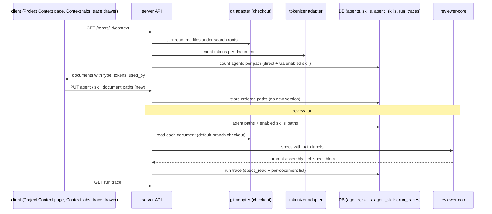
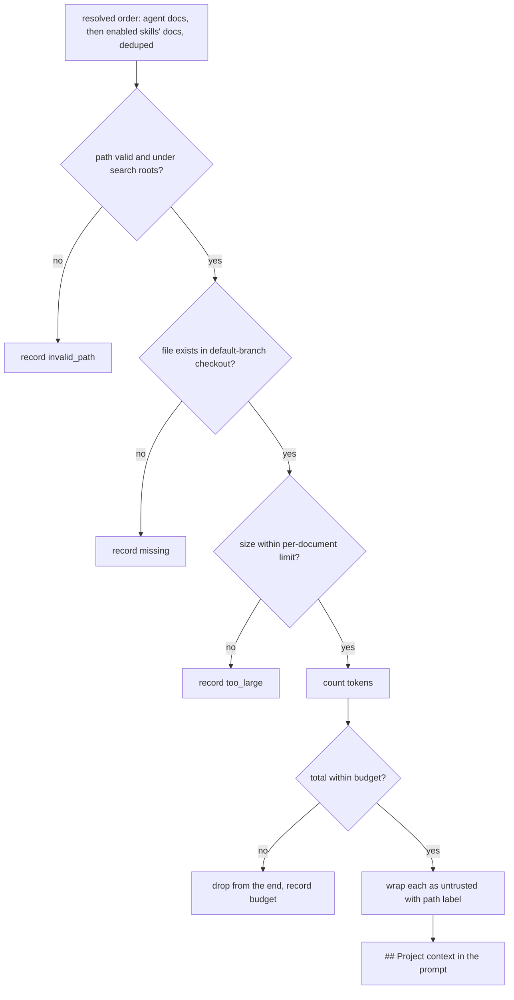

# Spec: Project Context
Spec ID: SPEC-01-project-context
Status: approved
Supersedes: none

## Problem and user

A reviewer agent today sees the diff, the PR description, the derived intent, skills and
repo-intel context. It does not see the project's own written rules. A PRD may say "no
endpoint may expose internal account IDs". An architecture note may say "module `api/`
does not import `db/` directly". These rules live as Markdown files in the repository, and
no run reads them. So the reviewer can only flag generic defects. It cannot flag a
violation of a rule that this project wrote down.

The prompt already has a place for this. `reviewer-core` renders a `## Project context`
section from untrusted spec text. The run trace already has a `specs_read` field. Both
are always empty today, because the server never fills them.

The user is a developer who owns reviewer agents and skills in DevDigest. They want to:
- see which Markdown documents the repository has;
- attach the right ones to an agent or a skill, and see the token cost first;
- check in the run trace exactly which documents the model got, with the full text.

Selection is manual on purpose. Automatic selection by PR content is a separate, later
feature. Manual selection first gives a baseline to measure that feature against.

## Goals / Non-goals

Goals:
- Find the `.md` documents under the configured search roots of a repository's synced
  checkout, and show them on a read-only Project Context page with a rendered preview.
- Let the user attach documents to an agent (in an order they choose) and to a skill.
  Every agent that has the skill enabled inherits the skill's documents.
- Show the token count of each document and of the attached set before the user attaches
  anything.
- Before a run, read the attached documents and put them into the prompt's
  `## Project context` section as untrusted, delimiter-wrapped data under the injection
  guard. This adds no model call.
- Make every run auditable: the trace lists each document that was read, its tokens and
  its origin; skipped documents with a reason; and the full text of the assembled block.

Non-goals:
- Automatic or content-based selection of documents (ranking, embeddings, "pick docs for
  this PR"). This is a separate feature.
- Editing documents in DevDigest. The page is read-only: no Edit toggle, no new file, no
  new folder, no upload, no rename, no delete. Reason: the checkout is reset to the remote
  branch on every sync (`reset --hard` in the git adapter), so an edit in the checkout is
  lost silently and never reaches GitHub. Real editing needs commit-and-PR write-back,
  which is a separate feature.
- Chunking, embeddings or vector indexing of documents. Whole documents are injected. The
  design footer "Indexed: 12 files · 1,240 chunks" is replaced by a discovery summary
  (AC-6).
- The "COVERAGE" ring from the design. It is replaced by "Used by N agents" (AC-5).
- A count or list of the skills that use a document. Skills already count through their
  agents in "Used by N agents".
- Versioning of attachments. A change to an agent's or a skill's documents does not create
  an agent version or a skill version. It takes effect on the next run.
- Documents that are not `.md`, or that are outside the repository checkout (PDF, URLs,
  Notion, Confluence).
- Per-run or per-PR overrides of the attached documents.
- Reading a document at the PR head. A run reads the default-branch checkout only (AC-21).
- Cutting a document to fit the budget. Documents are dropped whole (AC-25).
- Search roots set per repository in the UI, now or as a planned follow-up. Roots come
  from server configuration only.
- MCP server tools and the pre-push working-copy review. `mcp-server` exposes no agent
  configuration, so it does not change.
- Locales other than `en`.

## User stories

- **US-1** As an agent owner, I want to see every Markdown document under the search roots
  of a repository, with its path, type and preview, so that I know what I can attach.
  → AC-1, AC-2, AC-3, AC-4, AC-6, AC-7, AC-8, AC-9, AC-35, AC-36, AC-37, AC-39, AC-40, AC-44
- **US-2** As an agent owner, I want to see which agents use a document, so that I know
  the effect of changing it. → AC-5
- **US-3** As an agent owner, I want to attach documents to an agent and set their order,
  so that I control what the model reads first and what survives the budget.
  → AC-10, AC-11, AC-12, AC-13, AC-14, AC-15, AC-16, AC-17
- **US-4** As an agent owner, I want to attach documents to a skill, so that every agent
  that uses the skill gets them without repeating the work. → AC-18, AC-19, AC-20
- **US-5** As an agent owner, I want to see token counts per document and for the attached
  set, so that I know the prompt cost before a run. → AC-3, AC-12, AC-19
- **US-6** As an agent owner, I want attached documents in the run prompt as untrusted
  data, so that the model applies my project's rules but cannot be commanded by them.
  → AC-21, AC-22, AC-23, AC-24, AC-25, AC-26, AC-27, AC-28, AC-38, AC-41, AC-42, AC-43
- **US-7** As an agent owner, I want the run trace to show which documents were read,
  their size, what was skipped and the full injected text, so that I can link a finding
  or a token cost to a document. → AC-29, AC-30, AC-31, AC-32, AC-33
- **US-8** As an agent owner, I want a run to finish and tell me when an attached document
  no longer exists, so that I do not get a smaller prompt in silence. → AC-17, AC-24, AC-31
- **US-9** As an agent owner, I want proof that an attached rule changes the review, so
  that I trust the feature. → AC-34

## Acceptance criteria (EARS)

Terms used below:
- **Search roots** — the configured glob patterns; the default is
  `**/{specs,docs,insights}/**/*.md`.
- **Document** — a `.md` file in the repository checkout that matches the search roots.
  It is identified by its path relative to the repository root.
- **Doc type** — `specs`, `docs` or `insights`: the first folder name in the path that
  matches one of the three root names. A path that matches a custom root with none of
  these names gets type `docs`.
- **Resolved order** — the run's merged list of attached documents: the agent's documents
  in the agent's order, then the documents of each enabled skill, in skill order and then
  in each skill's order. A path appears only once, at its first position.

### Discovery and the Project Context page

- **AC-1** [server] WHEN the API receives a request for the documents of a repository,
  the API shall return every `.md` file under the search roots of that repository's
  synced checkout, each with its path, doc type, size in bytes, token count and the
  number of agents that use it. *Verify: it*
- **AC-2** [server] The API shall read the search roots from server configuration, and
  shall use `**/{specs,docs,insights}/**/*.md` when none is set. *Verify: unit*
- **AC-3** [server] The API shall count document tokens with the same tokenizer that
  counts skill-body tokens, so the same text gets the same count in both places.
  *Verify: unit*
- **AC-4** [client] WHEN the user opens Project Context from the sidebar, the page shall
  show the documents of the current repository as a list grouped by folder, and shall
  open the first document in the preview. *Verify: e2e*
- **AC-5** [client] WHILE a document is open in the preview, the page shall show its path,
  its token count and "Used by N agents". N counts each agent once if the document is
  attached to it directly or through a skill that is enabled on that agent. *Verify: unit + it*
- **AC-6** [client] The page shall show a discovery summary with the number of documents,
  their total tokens and the time of the last scan, in place of the design's indexing
  footer. *Verify: unit*
- **AC-7** [client] WHEN the user selects a document, the preview shall render its current
  content as read-only Markdown with styled headings, lists and code, and the page shall
  offer no control that changes a document. *Verify: unit + manual*
- **AC-40** [client] IF a document contains raw HTML or a script, THEN the preview shall
  show it as text and shall not run it. *Verify: unit*
- **AC-8** [client] WHEN the user presses Refresh on the page, the client shall ask the API
  to scan the checkout again, and the list shall show files that were added, removed or
  renamed since the last scan. *Verify: e2e*
- **AC-9** [client] IF the repository has no documents under the search roots, THEN the
  page shall show an empty state that names the active search roots. *Verify: unit*
- **AC-35** [server] IF the repository has no synced checkout, THEN the API shall answer
  `409` with the reason "repository not synced". *Verify: it*
- **AC-39** [client] IF the documents request answers `409`, THEN the page and the Context
  tabs shall show the API reason and a Refresh action instead of the list. *Verify: unit*
- **AC-44** [client] WHILE the documents request is loading, the page and both Context
  tabs shall show a loading placeholder and keep attach checkboxes disabled.
  *Verify: unit*
- **AC-36** [server] The API shall never write, create, rename or delete a file in the
  checkout as a result of any Project Context request. *Verify: it*

### Agent Context tab

- **AC-10** [client] WHEN the user opens the Context tab of an agent, the tab shall list
  the documents of the current repository, each with a checkbox, file name, folder, doc
  type badge and Preview action. Attached documents come first, in their saved order.
  *Verify: unit*
- **AC-11** [client] The tab header shall show "K of M attached", where K is the number of
  attached documents and M the number of listed documents. *Verify: unit*
- **AC-12** [client] WHILE at least one document is attached, the tab shall show the total
  tokens of the attached documents ("≈ T tokens") and the note that they are injected as
  an untrusted `## Project context` block into every run. *Verify: unit*
- **AC-13** [client] WHEN the user types in "Filter documents…", the tab shall show only
  documents whose path contains the text, ignoring case, and shall keep the attachment
  state of hidden documents. *Verify: unit*
- **AC-14** [client] WHEN the user checks, unchecks or drags an attached document to a new
  position, the client shall save the agent's new ordered path list at once, with no
  separate Save button. *Verify: unit + it*
- **AC-15** [server] WHEN the API saves an agent's document list, the API shall store
  only repository-relative paths in their order, and shall not create a new agent
  version. *Verify: it*
- **AC-16** [client] IF saving the document list fails, THEN the tab shall restore the
  last saved state and show a toast with the API error message. *Verify: unit*
- **AC-17** [client] IF an attached path is not among the listed documents, THEN the tab
  shall show it as attached with the badge "Missing", no token count, and an action to
  detach it. *Verify: unit*
- **AC-37** [client] WHEN the user presses Preview on a row, the client shall show that
  document's rendered Markdown and its token count in an overlay that closes with
  Escape and returns focus to the row. *Verify: unit*

### Skill Context tab

- **AC-18** [client] WHEN the user opens the Context tab of a skill, the tab shall show the
  title "Project context to use", the count "N attached", the note "Any agent using this
  skill inherits these documents", and the same list, filter, preview, ordering and
  missing-document behaviour as the agent Context tab (AC-10, AC-13, AC-14, AC-16, AC-17,
  AC-37). *Verify: unit*
- **AC-19** [client] The skill Context tab shall show a "Serializes as" preview that uses
  the heading `## Project context` and lists the attached paths in order, and the total
  tokens of the attached documents. *Verify: unit*
- **AC-20** [server] WHEN the API saves a skill's document list, the API shall store only
  the ordered paths, and shall not change the skill version or write a `skill_versions`
  row. *Verify: it*

### Run-time injection

- **AC-21** [server] WHEN a review run starts for an agent, the run executor shall read
  each document of the resolved order from the repository's default-branch checkout,
  not from the PR head. *Verify: it*
- **AC-22** [reviewer-core] WHEN attached documents are read, the prompt shall contain one
  `## Project context` section that wraps each document as an untrusted block labelled
  with its path, in the resolved order. *Verify: unit*
- **AC-23** [reviewer-core] IF a document contains a closing `</untrusted>` delimiter or
  text that reads as instructions, THEN the prompt shall escape the delimiter, keep the
  text inside the document's untrusted block, and keep the shared injection guard in the
  system prompt. *Verify: unit*
- **AC-41** [server] IF the same path is attached to the agent and to one or more of its
  enabled skills, THEN the run executor shall inject it once, at its first position in
  the resolved order. *Verify: unit*
- **AC-42** [server] IF the PR under review changes an attached document, THEN the run
  executor shall still inject the default-branch version of that document. *Verify: it*
- **AC-43** [server] IF a skill with attached documents is disabled on the agent, THEN the
  run executor shall leave the skill's documents out of the resolved order, and the API
  shall not count that agent in the document's "Used by". *Verify: unit + it*
- **AC-24** [server] IF an attached document does not exist in the checkout, THEN the run
  executor shall skip it, record it with the reason `missing`, and finish the run.
  *Verify: it*
- **AC-25** [server] IF the documents of the resolved order exceed the project-context
  token budget, THEN the run executor shall drop whole documents from the end of the
  resolved order until the rest fits, and record each dropped one with the reason
  `budget`. *Verify: unit*
- **AC-26** [server] IF an attached path is absolute, contains `..`, resolves outside the
  checkout (also through a symlink), is not `.md`, or does not match the search roots,
  THEN the run executor shall not read it and shall record it with the reason
  `invalid_path`. *Verify: unit + it*
- **AC-27** [server] WHILE an agent has no attached documents and no enabled skill with
  attached documents, the run shall send a prompt without a `## Project context`
  section, the same as today. *Verify: unit*
- **AC-28** [server] The run executor shall add project context without any extra model
  call. *Verify: unit*
- **AC-38** [server] IF a document is larger than the per-document size limit, THEN the
  run executor shall skip it and record it with the reason `too_large`. *Verify: unit*

### Run trace

- **AC-29** [server] WHEN a run completes, the trace shall store `specs_read` as the paths
  that were injected, and a list of every resolved document with path, origin (`agent`
  or the skill name), tokens, and status `included`, `missing`, `budget`, `invalid_path`
  or `too_large`. *Verify: it*
- **AC-30** [client] WHILE a trace has injected documents, the Configuration section of
  the trace drawer shall list each injected path under "Specs read" with its token
  count. *Verify: unit*
- **AC-31** [client] WHILE a trace has skipped documents, the Configuration section shall
  list each one under "Specs skipped" with its reason. *Verify: unit*
- **AC-32** [client] WHILE a trace has project context, the Prompt assembly section shall
  show the row "Project context — attached specs (untrusted)", and expand and fullscreen
  shall show the exact block text that was sent to the model. *Verify: unit + e2e*
- **AC-33** [client] IF a stored trace has no per-document list (a trace from before this
  feature), THEN the drawer shall render it as today with no error. *Verify: unit*

### Proof of value

- **AC-34** [server] WHEN an agent with the attached invariant "module api/ does not import
  db/ directly" reviews a PR where a file under api/ imports from db/, the review shall
  contain a finding that names the document path and points to the import line.
  *Verify: e2e + manual*

## Module interactions

Contracts at the boundary:

| Contract | State | Direction | Fields |
|----------|-------|-----------|--------|
| `GET /repos/:id/context` | new route; client hook `useContextFiles` exists | server → client | list of `SpecFile` (existing) extended with new fields: `type` (`specs`\|`docs`\|`insights`), `tokens`, `used_by` (number); plus a summary: `roots`, `count`, `total_tokens`, `scanned_at` |
| `GET /repos/:id/context/file?path=` | new | server → client | `path`, `content`, `tokens`; `404` if the file is not a document; `400` for an invalid path |
| `POST /repos/:id/context/reindex` | new route; client hook `useReindexContext` exists | client → server | re-scan the checkout; returns `IndexStatus` (existing; `status` `done` or `error`, `chunks_indexed` unused) |
| Agent document list | new field on `Agent` (existing, `contracts/knowledge.ts`) | both | `context_docs`: ordered list of paths |
| Skill document list | new field on `Skill` (existing, `contracts/knowledge.ts`) | both | `context_docs`: ordered list of paths |
| `RunTrace.specs_read` | existing (`contracts/trace.ts`), always `[]` today | server → client | injected paths |
| `RunTrace` per-document list | new, optional (nullish) | server → client | per item: `path`, `origin`, `tokens`, `status` |
| `PromptAssembly.specs` | existing (`contracts/trace.ts`) | server → client | full text of the `## Project context` block |

Errors: `404` when the repository does not exist; `409` when it has no synced checkout;
`400` for an invalid path. Storage: the ordered path lists are kept on the existing
`agents` and `skills` rows (decision of the user). No new table.

Run flow with the skip and drop rules:

## Edge cases

- **EC-1** An attached document was deleted, renamed or moved since it was attached.
  → AC-17, AC-24
- **EC-2** The attached documents together exceed the token budget. → AC-25
- **EC-3** A stored path is crafted to escape the checkout (`../`, absolute path,
  symlink). → AC-26
- **EC-4** A document contains text like "ignore previous instructions" or a closing
  `</untrusted>` tag. → AC-23
- **EC-5** The same document is attached to the agent and to one of its skills. It is
  injected once, at its first position. → AC-22, AC-41
- **EC-6** The repository has never been synced, or its checkout is gone. → AC-35, AC-39
- **EC-7** The repository has no documents under the search roots. → AC-9
- **EC-8** A document is very large (for example, a generated changelog). → AC-38
- **EC-9** The PR under review edits an attached document. The run still reads the
  default-branch version, so the PR cannot weaken the rule it is checked against.
  → AC-21, AC-42
- **EC-10** Saving the document list fails (network or server error). → AC-16
- **EC-11** A trace was stored before this feature, with no per-document list. → AC-33
- **EC-12** The agent is used on another repository where an attached path does not
  exist. The path is skipped as `missing`. → AC-17, AC-24
- **EC-13** A skill with documents is disabled on the agent. Its documents are not in the
  resolved order and do not count in "Used by". → AC-5, AC-43
- **EC-14** Document Markdown contains raw HTML or scripts. The preview renders it
  without running scripts. → AC-40

## Non-functional requirements

- **NFR-1** Performance: `GET /repos/:id/context` shall answer within 500 ms at p95 for a
  checkout with 200 documents of 20 KB each. *Verify: it*
- **NFR-2** Performance: project-context resolution shall add at most 300 ms at p95 to a
  run with 10 attached documents. *Verify: it*
- **NFR-3** Cost: the feature shall add 0 model calls per run. *Verify: unit*
- **NFR-4** Limits: the default project-context budget shall be 8,000 tokens per run,
  configurable on the server. *Verify: unit*
- **NFR-5** Limits: the default per-document size limit shall be 256 KB; larger files are
  listed on the page with their size but are skipped in a run as `too_large`.
  *Verify: unit*
- **NFR-6** Limits: discovery shall list at most 1,000 documents per repository, and the
  page shall say when the list was cut. *Verify: it*
- **NFR-7** Security: 0 bytes of document content shall be written to the server log or
  the run log; they carry only paths, token counts and statuses. *Verify: unit*
- **NFR-8** Observability: every resolved document of a run shall appear in the trace
  with one of the five statuses (AC-29). *Verify: it*
- **NFR-9** Accessibility: the Project Context page and both Context tabs shall be fully
  usable with the keyboard, including reorder (move up / move down), with 0 axe
  violations of level A or AA. *Verify: e2e*
- **NFR-10** i18n: every new UI string shall come from `client/messages/en/*.json`.
  *Verify: unit*

## Assumptions

- **A-1** The budget of 8,000 tokens and the 256 KB size limit fit today's models. They are
  starting values, not measured. Risk if wrong: too few documents fit, or prompts grow
  too large; both are server settings, so the fix is a config change.
- **A-2** The default-branch checkout under the clone directory is the only source of
  document text. Risk if wrong: a repository whose docs live only on another branch shows
  no documents.
- **A-3** One workspace works with one repository at a time, and the sidebar repository
  switcher decides the "current repository" for the Context tabs. Risk if wrong: an agent
  shared across repos shows many `Missing` rows.
- **A-4** Agents with no saved document list behave like agents with an empty list. Risk if
  wrong: existing agents need a data backfill.
- **A-5** The seeded demo repository can carry fixture documents for e2e and for AC-34.
  Risk if wrong: the e2e flow needs its own fixture repository.
- **A-6** The existing `SpecFile` contract can be extended with optional fields without
  breaking the client hooks that already reference it. Risk if wrong: a new contract name
  is needed.

## Inputs and provenance

- Request (user, 2026-10-03): feature "Project Context"; manual selection only; server
  finds `.md` under `specs/`, `docs/`, `insights/` with roots from configuration and the
  default glob `**/{specs,docs,insights}/**/*.md`; agent editor Context tab with checkbox,
  path, type, search and preview; the same "Project context to use" section for skills;
  store paths, not text; run executor reads the files into `## Project context` as
  untrusted data with delimiters and injection guard; trace shows `specs_read`, the
  documents and their tokens; no extra model call; check with the `api/` → `db/`
  invariant (AC-34: a seeded fixture with a stub model in e2e, plus one manual run
  against a real model).
- Request: a missing attached document is skipped and recorded (AC-24); "Coverage and
  usage" becomes "used by N agents" (AC-5); no new version on attachment change (AC-15,
  AC-20); the prompt-assembly view shows "Project context — attached specs" with full
  text (AC-32).
- Designs (4 screenshots, read): Project Context page (file list, Preview/Edit, "Used by 3
  agents", "78 COVERAGE", "Indexed: 12 files · 1,240 chunks"); agent Context tab ("2 of 7
  attached", filter, drag handles, type badges, Preview, "≈ 317 tokens", untrusted note);
  skill Context tab ("Project context to use", "1 attached", "Serializes as
  ## Project specifications"); run trace drawer (Specs read, Prompt assembly rows).
- Round 1, Q: "Editing documents?" → "If editing in the filesystem is hard, view-only."
  Finding: the checkout is reset with `reset --hard origin/<branch>` on sync
  (`server/src/adapters/git/simple-git.ts:86`), so edits are lost and never reach GitHub.
  Decision: view-only (Non-goals, AC-7, AC-36).
- Round 1, Q: "Where to store attached paths?" → ordered path list on `agents` and
  `skills` rows, no new table (Module interactions, AC-15, AC-20).
- Round 1, Q: "Which revision does a run read?" → default-branch checkout (AC-21, EC-9).
- Round 1, Q: "Too many tokens?" → budget, drop whole documents from the end, record
  them (AC-25, NFR-4).
- Round 2, Q: "Skill docs vs agent docs in the prompt?" → one `## Project context` block,
  no duplicates; the design's `## Project specifications` is replaced (AC-19, AC-22,
  EC-5).
- Round 2, Q: "Who counts in Used by N agents?" → direct and through an enabled skill
  (AC-5, EC-13).
- Round 2, Q: "Where are search roots set?" → server configuration / env only (AC-2,
  Non-goals).
- Round 2, Q: "How is a path bound to a repo?" → path relative to the run's repository;
  missing → skipped and recorded (AC-24, EC-12).
- Round 3, Q-1: "Show which skills use a document?" → No, only "Used by N agents"
  (Non-goals).
- Round 3, Q-2: "Per-repository search roots in the UI later?" → Not planned (Non-goals).
- Round 3: planner questions stay with `implementation-planner` (Q-3, Q-4, Q-5).
- Code read: `reviewer-core/src/prompt.ts` (`wrapUntrusted`, `INJECTION_GUARD`, section
  order, specs labelled `spec-N` today); `server/src/modules/reviews/run-executor.ts`
  (`specs_read: []` hard-coded); `server/src/vendor/shared/contracts/trace.ts`
  (`PromptAssembly.specs`, `RunTrace.specs_read`);
  `server/src/vendor/shared/contracts/platform.ts` (`SpecFile`, `IndexStatus`);
  `client/src/lib/hooks/core.ts` (`useContextFiles`, `useReindexContext`, unused);
  `client/messages/en/context.json` (unused strings); `server/src/adapters/tokenizer`;
  `server/src/modules/skills/stats.ts` (agent count pattern); `server/src/db/schema/`
  (`agents`, `skills`, `agent_skills`, unused `code_chunks`).
- Reference, not merged: upstream SPEC-09 "Project Context Folder" (commits `6f01ee6`,
  `41464fa`, `b77246e` on `upstream/full-functionality`). Used for the path-escape fix
  and the drop-whole-documents rule; its two new tables are not taken (AGENTS.md: do not
  add tables).
- INSIGHTS used: server — "a run trace is a jsonb blob replayed verbatim" (new trace
  fields stay optional, AC-33); server — "a missing feature is often surgically removed"
  (found SPEC-09); client — "a tab body chosen by `TAB_COMPONENTS[tab]` unmounts on every
  switch" (auto-save in AC-14); client — "markdown renders flat everywhere" (AC-7 manual
  check); e2e — "`wait --text` must match rendered uppercase text".

## Untrusted inputs

- Document content comes from the repository and may contain prompt injection. It is
  wrapped as untrusted per document, the closing delimiter is escaped, and the shared
  injection guard is in the system prompt (AC-22, AC-23).
- Document paths come from the repository and are used as block labels. The label is
  sanitized so a path cannot break the delimiter attribute (AC-22, AC-26).
- Stored attached paths come from API requests. The server validates them on save and
  again on read: relative, no `..`, inside the checkout after symlink resolution, `.md`,
  inside the search roots (AC-26).
- The `path` query parameter of the file route is checked by the same rules (`400`).
- Document Markdown is rendered in the client without raw HTML execution (EC-14).
- Model findings that cite a document are model output and go through the existing
  grounding gate like every finding.

## Open questions

- **Q-3** (planner) Separate routes for the agent and skill document lists, or extra
  fields on the existing `PUT /agents/:id` and `PUT /skills/:id` — given that `PUT
  /agents/:id` writes an agent version today and AC-15 forbids that.
- **Q-4** (planner) Where to put the type badge and grouping logic so the Project Context
  page and both Context tabs share one list component.
- **Q-5** (planner) Scan on every `GET` or keep a short in-memory cache refreshed by
  `POST /repos/:id/context/reindex`, given NFR-1.

## Traceability

| AC | Stories | Edge cases | NFR | Verify |
|----|---------|------------|-----|--------|
| AC-1 | US-1 | — | NFR-1, NFR-6 | it |
| AC-2 | US-1 | — | — | unit |
| AC-3 | US-1, US-5 | — | — | unit |
| AC-4 | US-1 | — | NFR-9, NFR-10 | e2e |
| AC-5 | US-2 | — | — | unit + it |
| AC-6 | US-1 | — | — | unit |
| AC-7 | US-1 | — | — | unit + manual |
| AC-8 | US-1 | — | — | e2e |
| AC-9 | US-1 | EC-7 | — | unit |
| AC-10 | US-3 | — | NFR-9 | unit |
| AC-11 | US-3 | — | — | unit |
| AC-12 | US-3, US-5 | — | — | unit |
| AC-13 | US-3 | — | — | unit |
| AC-14 | US-3 | — | NFR-9 | unit + it |
| AC-15 | US-3 | — | — | it |
| AC-16 | US-3 | EC-10 | — | unit |
| AC-17 | US-3, US-8 | EC-1, EC-12 | — | unit |
| AC-18 | US-4 | — | — | unit |
| AC-19 | US-4, US-5 | — | — | unit |
| AC-20 | US-4 | — | — | it |
| AC-21 | US-6 | EC-9 | NFR-2 | it |
| AC-22 | US-6 | EC-5 | — | unit |
| AC-23 | US-6 | EC-4 | — | unit |
| AC-24 | US-6, US-8 | EC-1, EC-12 | NFR-8 | it |
| AC-25 | US-6 | EC-2 | NFR-4 | unit |
| AC-26 | US-6 | EC-3 | — | unit + it |
| AC-27 | US-6 | — | — | unit |
| AC-28 | US-6 | — | NFR-3 | unit |
| AC-29 | US-7 | — | NFR-7, NFR-8 | it |
| AC-30 | US-7 | — | — | unit |
| AC-31 | US-7, US-8 | — | — | unit |
| AC-32 | US-7 | — | — | unit + e2e |
| AC-33 | US-7 | EC-11 | — | unit |
| AC-34 | US-9 | — | — | e2e + manual |
| AC-35 | US-1 | EC-6 | — | it |
| AC-36 | US-1 | — | — | it |
| AC-37 | US-1, US-3 | — | NFR-9 | unit |
| AC-38 | US-6 | EC-8 | NFR-5 | unit |
| AC-39 | US-1 | EC-6 | — | unit |
| AC-40 | US-1 | EC-14 | — | unit |
| AC-41 | US-6 | EC-5 | — | unit |
| AC-42 | US-6 | EC-9 | — | it |
| AC-43 | US-2, US-6 | EC-13 | — | unit + it |
| AC-44 | US-1 | — | — | unit |
